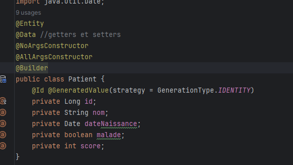
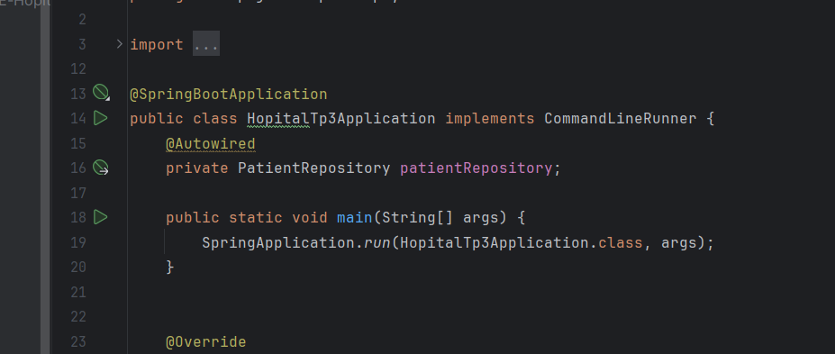
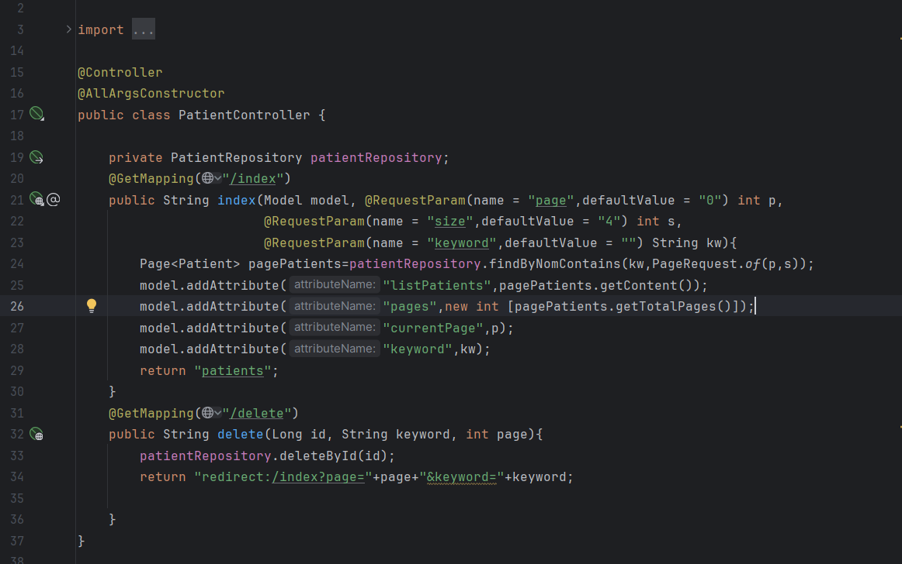
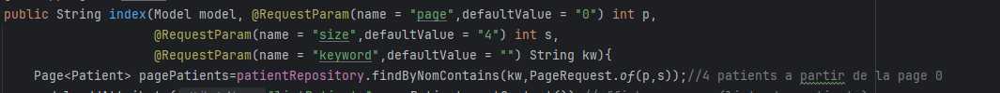
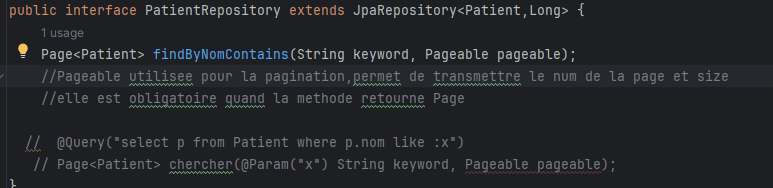
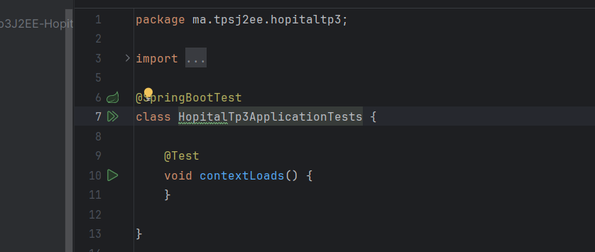

<h3>TP3 partie 1</h3>
<h4>Patient</h4>

<h4>webapp </h4>

<h4>Base de donnees MySql</h4>

<h4>controller patient</h4>

<h5>1/ Controller</h5>

<h5>3/ Repository</h5>

<h5>1/ Controller</h5>

<h5>3/ test</h5>

